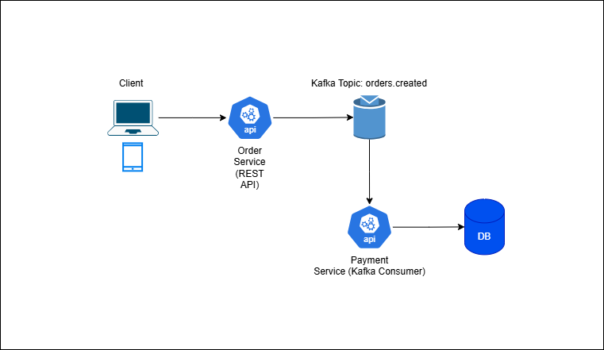
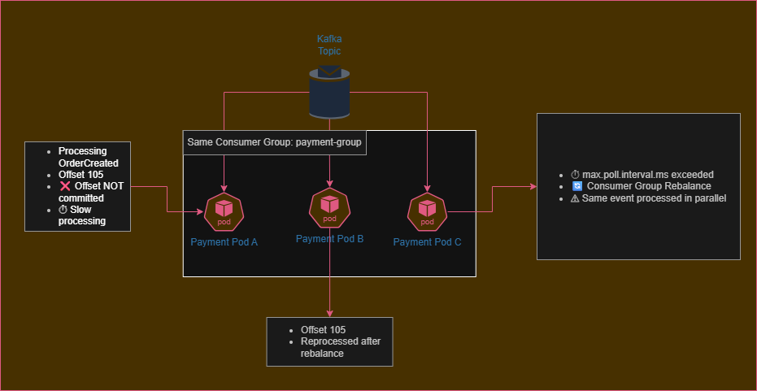
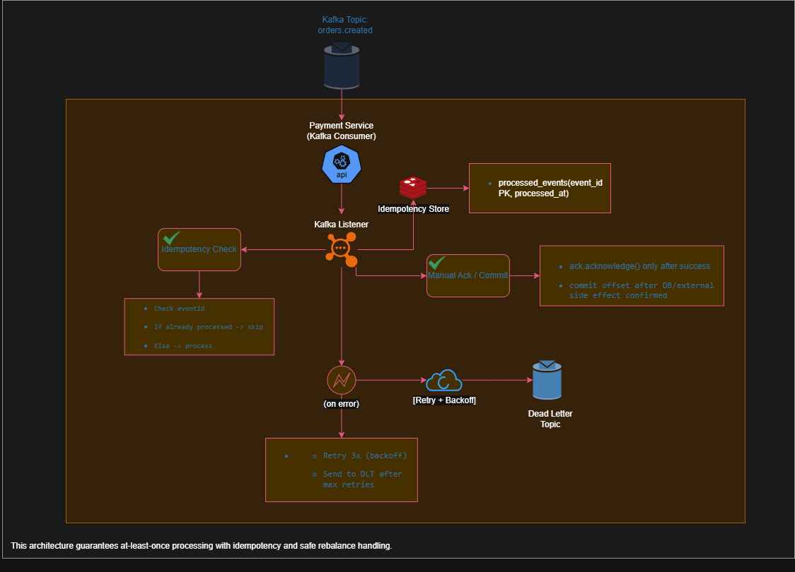

# Kafka Consumer Failure & Resilience Lab

A production-inspired event-driven project built with Spring Boot + Spring Kafka to **reproduce real Kafka consumer failure scenarios** (offset commit issues, consumer group rebalance, parallel processing) and then **fix them with production-grade patterns** (manual ack, idempotency, retry/backoff, dead-letter topic).

## What this project demonstrates
- A baseline event-driven flow (Order -> Kafka -> Payment)
- Failure scenarios that are hard to catch in homolog environments (single pod)
- Production-ready consumer patterns:
  - Manual offset commit (ack after success)
  - Idempotent processing (event deduplication)
  - Retry with backoff
  - Dead Letter Topic (DLT)

## Architecture diagrams
### 1) Baseline

### 2) Failure scenario (production-like)

### 3) Production-ready solution

Failure Scenario Reproduced

Two consumer instances in the same group

max.poll.interval.ms lower than processing time

Consumer removed from group during processing

Rebalance triggered

Same offset reprocessed by another instance

Result: duplicated business execution

This simulates a real production rebalance + offset commit failure.

Solutions Implemented
1️⃣ Manual Offset Commit

enable-auto-commit=false

ack-mode=manual_immediate

Offset committed only after successful processing

Prevents message loss when crashing mid-processing.

2️⃣ Idempotent Processing

processed_events table with event_id as primary key

Flow:

Check if processed → skip

Process business logic

Mark as DONE

ACK offset

Ensures business-level exactly-once behavior on top of Kafka’s at-least-once delivery.

3️⃣ Retry + Dead Letter Topic

Fixed backoff retry (3 attempts)

On failure → publish to orders.created.DLT

DLT consumer isolates poison messages

Prevents consumer blockage and infinite retries.

Final Architecture Guarantees

✔ No message loss
✔ No duplicated side effects
✔ Safe multi-instance scaling
✔ Resilient to rebalances
✔ Production-ready consumer patterns

## Failure Evidence (Real Logs)

Pod A:
PROCESSED eventId=d59d3200-e127-436b-a8d8-856a396ac22f

Pod B:
PROCESSED eventId=d59d3200-e127-436b-a8d8-856a396ac22f

This demonstrates the at-least-once behavior combined with rebalance.

📸 Example log: docs/images/

## Tech stack (planned)
- Java 21 + Spring Boot 3
- Spring Kafka
- Postgres (payments + idempotency)
- Docker Compose (local dev)
- Kubernetes (optional later, for scale/rebalance demos)
- Testcontainers (integration tests)

## Roadmap
- [ ] Repo foundation + docs
- [ ] MVP: order-service producing events
- [ ] MVP: payment-service consuming events (naive version)
- [ ] Reproduce failure scenarios (rebalance + missing commit)
- [ ] Apply production-ready fixes (manual ack + idempotency + DLT)
- [ ] Integration tests + CI
